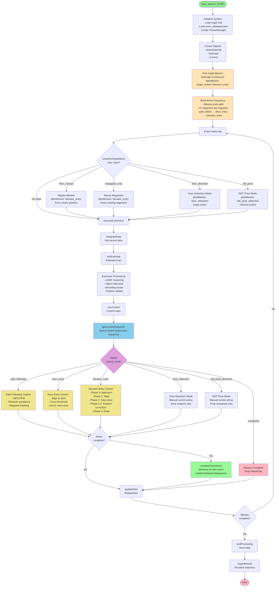

# Wheelchair Navigation Algorithm - High Level Flowchart

This flowchart shows the complete execution flow from `main_astar.m` to program completion.

## Color Legend

- **Green (Start/End):** Program entry and exit points
- **Light Orange:** Mission planning and action sequence generation
- **Light Blue:** Phase management and decision points
- **Purple:** Control mode dispatch (main switch statement)
- **Yellow:** Active control execution phases
- **Light Green:** Transition handling between actions
- **Pink:** Completion states

## Key Components

### 1. Initialization
- Load occupancy map (`map2.mat`)
- Load room database for multi-room navigation
- Create shared PhaseManager instance

### 2. Mission Planning
- Generate action sequence based on `target_action`
- Use Dijkstra for high-level room routing
- Use A* for low-level waypoint generation

### 3. Main Control Loop
- Continuous sensor data acquisition
- Estimation (LiDAR clustering, object detection)
- Control (MPC path following, door entry, elevator entry)
- Real-time display and data logging

### 4. Phase Management
- PhaseManager tracks current action in sequence
- `getCurrentPhaseInfo()` returns appropriate control mode
- `completeTransition2()` advances to next action

### 5. Control Modes
- **path_following:** MPC-based waypoint tracking
- **door_entry:** 4-phase door crossing sequence
- **elevator_entry:** 6-phase elevator entry/exit sequence
- **door_detection:** Debug mode for door sensing
- **ndt_pose_detection:** Manual control with pose broadcast

## File References

- **Main:** `main_astar.m`
- **Main Loop:** `src/Object/@wheelchairObj/mainLoop.m`
- **Execute:** `src/Object/@wheelchairObj/executeCommand.m`
- **Estimate:** `src/Estimator/Estimate.m`
- **Control:** `src/Controller/@Control/Control.m`
- **Phase Manager:** `src/PhaseManager.m`

---

*Generated: 2025-01-27*
*Part of wheelchair_experiment project documentation*
