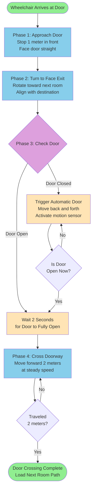
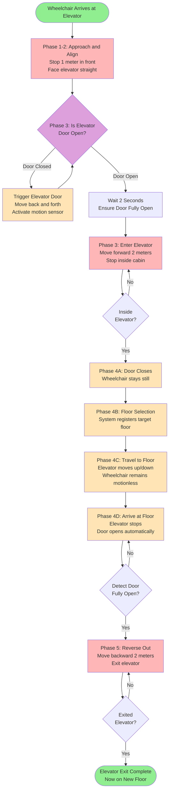
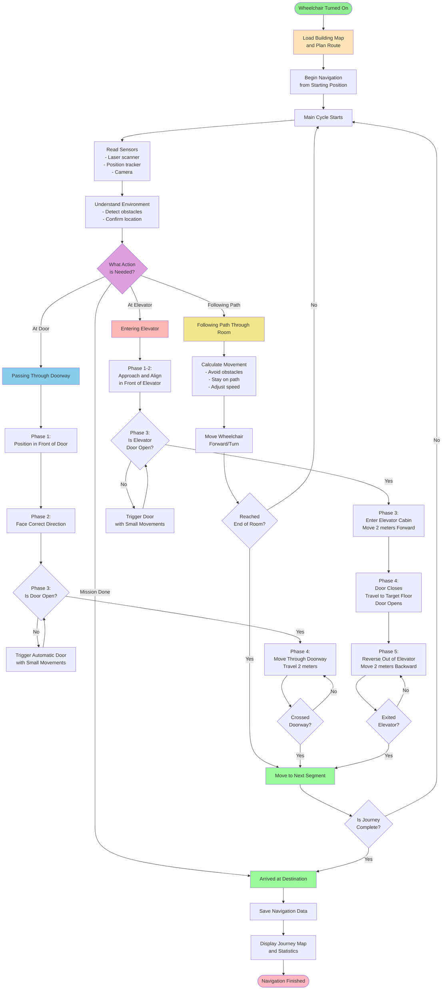

# Wheelchair Navigation System - Simple Explanation

## Overview

The autonomous wheelchair navigates from its starting position to an elevator, travels between floors, and exits. The system guides the wheelchair through rooms, doorways, and the elevator automatically.

## Quick Navigation

This document includes detailed flowcharts for:
- **[Door Crossing Phases](#door-crossing-flowchart)** - 4 phases with visual diagram
- **[Elevator Entry Phases](#elevator-entry-flowchart)** - 6 phases with visual diagram
- **[Complete System Flowchart](#flowchart)** - Overall navigation process

---

## Navigation Process

### 1. System Startup

**Map Loading**
- Wheelchair reads a pre-made map of the building
- Map shows walls, rooms, doors, and elevator location
- Building layout includes multiple rooms connected by doorways

**Route Planning**
- System calculates best path from current location to elevator
- Breaks journey into segments: Room A → Door → Room B → Door → Room C → Elevator
- Plans specific points (waypoints) to follow in each room

---

### 2. Main Navigation Cycle

The wheelchair repeats this cycle continuously until reaching the destination:

#### Step 1: Read Sensors
- Laser scanner detects surrounding obstacles and walls
- Position tracker determines current location on map
- Camera identifies nearby objects

#### Step 2: Understand Environment
- Identifies objects (people, furniture, walls)
- Measures distance to obstacles
- Confirms current position on map

#### Step 3: Decide Action
System determines what to do based on current situation:
- **Following Path:** Continue moving along planned route
- **Entering Door:** Navigate through doorway to next room
- **Entering Elevator:** Special sequence to enter and exit elevator

#### Step 4: Calculate Movement
- Determines safe direction to move
- Avoids obstacles detected by sensors
- Adjusts speed based on proximity to objects
- Maintains alignment with planned path

#### Step 5: Execute Movement
- Sends movement commands to wheelchair motors
- Moves forward at calculated speed
- Turns to follow path or avoid obstacles

#### Step 6: Check Progress
- Verifies if current segment completed
- Advances to next navigation segment when ready
- Updates display showing current status

---

## Navigation Segments

### Segment Type 1: Following Path in a Room

**What happens:**
- Wheelchair follows a series of guide points through the room
- Continuously checks sensors to avoid obstacles
- Adjusts path if objects block the way
- Moves toward the room exit (doorway)

**Progress tracking:**
- Marks each guide point as "reached" when wheelchair passes it
- Moves to next guide point automatically
- Completes when all guide points in room are reached

---

### Segment Type 2: Passing Through a Doorway

**Phase 1: Approach Door**
- Wheelchair positions itself 1 meter in front of doorway
- Aligns to face the door straight-on
- Stops to prepare for door crossing

**Phase 2: Face Exit Direction**
- Rotates to point toward the next room's path
- Ensures proper orientation before crossing
- Aligns with where it needs to go after passing through

**Phase 3: Check Door is Open**
- Laser scanner looks for obstacles in doorway
- **Door Open:** Few or no obstacles detected → proceed
- **Door Closed:** Solid surface detected → trigger automatic door
  - Performs small back-and-forth movements
  - Activates motion sensor on automatic door
  - Waits for door to open
- Confirms door is passable before moving

**Phase 4: Cross Threshold**
- Moves straight through doorway at steady speed
- Travels 2 meters forward to clear the door completely
- Uses distance measurement, not position (more reliable during crossing)

**Phase 5: Continue in Next Room**
- Loads guide points for the new room
- Begins following path through next room

**Duration:** 5-15 seconds per door

#### Door Crossing Flowchart

### Segment Type 3: Entering Elevator

This is the most complex segment with multiple sub-stages:

#### Stage 1: Approach and Align (Phases 1-2)
- Positions 1 meter in front of elevator door
- Rotates to face elevator entrance straight-on
- Aligns perfectly for smooth entry

#### Stage 2: Door Opening (Phase 3)
- Laser scanner checks if elevator door is open
- **Door Closed:** Detects solid surface
  - Performs small movements to trigger motion sensor
  - Waits for automatic door to open
- **Door Open:** Detects clear path inside
  - Waits 2 seconds for door to fully open
  - Proceeds to entry

#### Stage 3: Enter Elevator (Phase 3)
- Moves straight into elevator cabin
- Travels 2 meters to reach center of elevator
- Stops inside elevator

#### Stage 4: Wait Inside (Phase 4)
**Sub-stage A: Door Closes**
- Elevator door closes automatically
- Wheelchair remains stationary inside

**Sub-stage B: Floor Selection**
- System registers desired floor number
- (In real system: interfaces with elevator panel)

**Sub-stage C: Travel to Floor**
- Elevator travels up or down to destination floor
- Wheelchair waits motionless during travel

**Sub-stage D: Door Opens**
- Elevator arrives at destination floor
- Door opens automatically
- Laser scanner detects when door is fully open

#### Stage 5: Exit Elevator (Phase 5)
- Wheelchair reverses backward out of elevator
- Travels same distance as entry (2 meters)
- Uses distance measurement to track progress
- Exits smoothly without turning around

**Why reverse?**
- Elevator cabin too small to turn around
- Reversing maintains stability
- Simpler than complex turning maneuvers

#### Stage 6: Complete (Phase 6)
- Wheelchair fully outside elevator on new floor
- Ready to continue navigation on new floor

#### Elevator Entry Flowchart

**Elevator Phases Summary:**

| Phase | What Happens | Wheelchair Movement | 
|-------|--------------|---------------------|
| **1-2** | Approach and align | Stop in front | 
| **3** | Check door, trigger if closed, enter | Forward 2 meters | 
| **4A** | Door closes | Stay still | 
| **4B** | Floor selection | Stay still | 
| **4C** | Travel between floors | Stay still | 
| **4D** | Arrive, door opens | Stay still | 
| **5** | Reverse out of elevator | Backward 2 meters | 
| **6** | Complete | Stop | 

---

## Complete Journey Example

**Starting Location:** Room A (Floor 4)
**Destination:** Elevator → Floor 1

### Journey Breakdown:

1. **Room A Navigation** (30 sec)
   - Follow 15 guide points through Room A
   - Avoid furniture and walls
   - Reach door to Room B

2. **Door A→B Crossing** (8 sec)
   - Approach door
   - Align to face Room B
   - Check door open
   - Cross into Room B

3. **Room B Navigation** (25 sec)
   - Follow 12 guide points through Room B
   - Navigate around obstacles
   - Reach door to Room C

4. **Door B→C Crossing** (10 sec)
   - Approach door
   - Wait for automatic door to open
   - Cross into Room C

5. **Room C Navigation** (20 sec)
   - Follow 8 guide points through Room C
   - Approach elevator entrance

6. **Elevator Entry** (45 sec)
   - Align in front of elevator (5 sec)
   - Wait for elevator door to open (5 sec)
   - Enter elevator cabin (5 sec)
   - Door closes (5 sec)
   - Travel from Floor 4 to Floor 1 (20 sec)
   - Door opens (3 sec)
   - Reverse out of elevator (7 sec)

**Total Time:** ~2 minutes 18 seconds

---

## Safety Features

### Obstacle Avoidance
- Continuously scans 360° around wheelchair
- Calculates safe paths around detected objects
- Slows down or stops if obstacles too close
- Replans route if original path blocked

### Door Safety
- Never attempts to cross closed door
- Actively opens automatic doors using motion trigger
- Waits for confirmation door is passable
- Stops immediately if door closes unexpectedly

### Elevator Safety
- Confirms door fully open before entering
- Remains stationary during floor travel
- Detects door opening before exiting
- Uses slow, controlled movements inside cabin

### Position Tracking
- Constantly monitors current location
- Verifies progress along planned path
- Uses multiple methods to confirm position
- Falls back to distance measurement if position uncertain

---

## User Interaction

**During Normal Operation:**
- System runs completely autonomously
- User can monitor progress on display
- Shows current room, action, and progress percentage

**Optional User Commands:**
- Can request wheelchair to replan route from current position
- Can activate special testing modes
- Can stop navigation at any time

---

## System Display

**Real-time Status Information:**

**Section 1: Position**
- Current X, Y coordinates on map
- Current facing direction
- Time elapsed

**Section 2: Navigation Progress**
- Current guide point: 8/15
- Distance to final destination
- Detected obstacles nearby

**Section 3: Current Action**
- "Following path in Room B"
- "Entering doorway to Room C"
- "Entering elevator - waiting for door"

**Section 4: Overall Progress**
- Action 3 of 6 (50% complete)
- Current segment: "Path following in Room B"

---

## Flowchart

## Color Legend

**Main Navigation Flowchart:**
- **Green:** Start and end points
- **Light Orange:** Initial setup and planning
- **Purple:** Decision points (what to do next)
- **Yellow:** Path following through rooms
- **Light Blue:** Door crossing sequences
- **Light Red:** Elevator entry and exit sequences
- **Light Green:** Progress advancement

**Door Crossing Flowchart:**
- **Green:** Start and completion
- **Light Blue:** Door phases (position, turn, cross)
- **Purple:** Door check decision
- **Light Orange:** Door triggering actions

**Elevator Flowchart:**
- **Green:** Start and completion
- **Light Red:** Elevator movement phases (approach, enter, reverse)
- **Light Orange:** Waiting phases (door close, travel, door open)
- **Purple:** Door check decision

---

## Summary

The autonomous wheelchair:

1. **Plans** a route through multiple rooms to reach the elevator
2. **Follows** guide points through each room while avoiding obstacles
3. **Crosses** through doorways using a 4-phase sequence
4. **Enters** the elevator using a 6-phase sequence
5. **Travels** between floors inside the elevator
6. **Exits** by reversing backward onto the new floor
7. **Repeats** this cycle for each room and door until reaching the destination

The entire process is automatic, requiring no user intervention. The wheelchair continuously monitors its sensors, adjusts its path to avoid obstacles, and safely navigates through the building environment.

---

*Created: 2025-01-27*
*Part of wheelchair_experiment project documentation*
