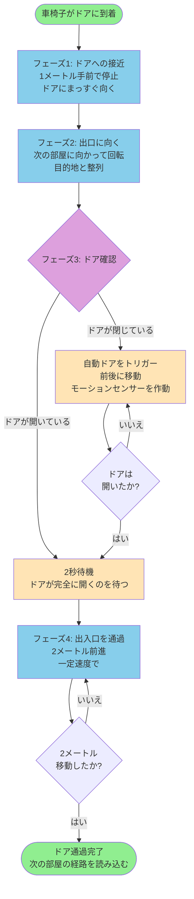
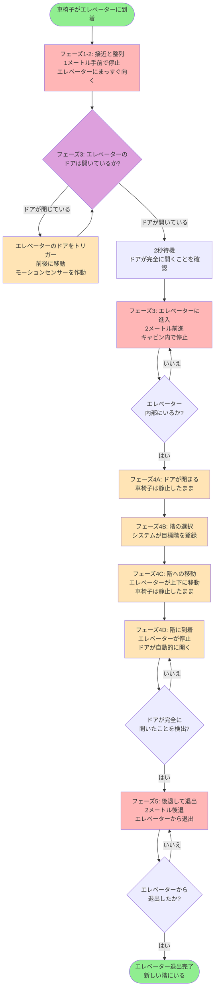
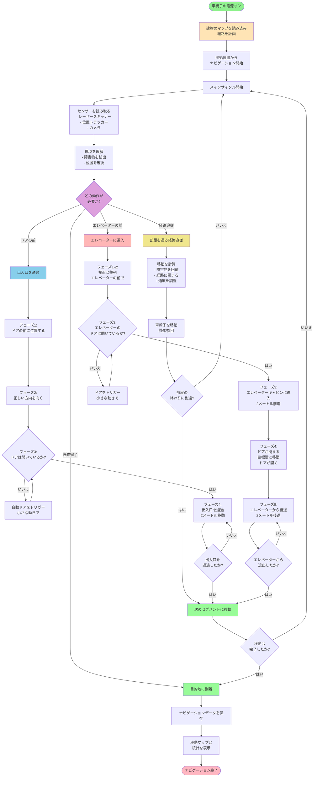

# 車椅子ナビゲーションシステム - 簡単な説明

## 概要

自律走行車椅子は、開始位置からエレベーターまで移動し、階間を移動して退出します。システムは車椅子を部屋、出入口、エレベーターを通じて自動的に誘導します。

## クイックナビゲーション

このドキュメントには以下の詳細なフローチャートが含まれています:
- **[ドア通過フェーズ](#ドア通過フローチャート)** - 4つのフェーズとビジュアル図
- **[エレベーター進入フェーズ](#エレベーター進入フローチャート)** - 6つのフェーズとビジュアル図
- **[完全システムフローチャート](#フローチャート)** - 全体的なナビゲーションプロセス

---

## ナビゲーションプロセス

### 1. システム起動

**マップ読み込み**
- 車椅子が建物の事前作成されたマップを読み込む
- マップには壁、部屋、ドア、エレベーターの位置が表示される
- 建物のレイアウトには、出入口で接続された複数の部屋が含まれる

**経路計画**
- システムが現在地からエレベーターまでの最適経路を計算する
- 移動を複数のセグメントに分割: 部屋A → ドア → 部屋B → ドア → 部屋C → エレベーター
- 各部屋で従うべき特定のポイント(ウェイポイント)を計画する

---

### 2. メインナビゲーションサイクル

車椅子は目的地に到達するまで、このサイクルを連続的に繰り返します:

#### ステップ1: センサー読み取り
- レーザースキャナーが周囲の障害物と壁を検出
- 位置トラッカーがマップ上の現在位置を特定
- カメラが近くの物体を識別

#### ステップ2: 環境理解
- 物体(人、家具、壁)を識別
- 障害物までの距離を測定
- マップ上の現在位置を確認

#### ステップ3: 動作決定
システムは現在の状況に基づいて何をすべきかを決定します:
- **経路追従:** 計画された経路に沿って移動を継続
- **ドア進入:** 次の部屋へ出入口を通過
- **エレベーター進入:** エレベーターへの進入と退出の特別なシーケンス

#### ステップ4: 移動計算
- 安全な移動方向を決定
- センサーで検出された障害物を回避
- 物体との近接度に基づいて速度を調整
- 計画された経路との整合性を維持

#### ステップ5: 移動実行
- 車椅子モーターに移動コマンドを送信
- 計算された速度で前進
- 経路に従うか障害物を回避するために旋回

#### ステップ6: 進捗確認
- 現在のセグメントが完了したかを確認
- 準備ができたら次のナビゲーションセグメントに進む
- 現在の状態を表示する画面を更新

---

## ナビゲーションセグメント

### セグメントタイプ1: 部屋内の経路追従

**動作内容:**
- 車椅子が部屋内の一連のガイドポイントに従う
- センサーを継続的にチェックして障害物を回避
- 物体が道を塞いでいる場合は経路を調整
- 部屋の出口(出入口)に向かって移動

**進捗追跡:**
- 車椅子が通過すると各ガイドポイントを「到達済み」とマーク
- 自動的に次のガイドポイントに移動
- 部屋内のすべてのガイドポイントに到達すると完了

---

### セグメントタイプ2: 出入口の通過

**フェーズ1: ドアへの接近**
- 車椅子が出入口の1メートル手前に位置する
- ドアにまっすぐ向くように整列
- ドア通過の準備のために停止

**フェーズ2: 出口方向を向く**
- 次の部屋の経路に向かって回転
- 通過前に適切な方向を確保
- 通過後に向かう必要がある方向と整列

**フェーズ3: ドアが開いているか確認**
- レーザースキャナーが出入口の障害物を探す
- **ドアが開いている:** 障害物がほとんどまたは全く検出されない → 進行
- **ドアが閉じている:** 固体表面を検出 → 自動ドアをトリガー
  - 小さな前後動作を実行
  - 自動ドアのモーションセンサーを作動
  - ドアが開くのを待つ
- 移動前にドアが通過可能であることを確認

**フェーズ4: しきいを越える**
- 一定速度で出入口をまっすぐ通過
- ドアを完全にクリアするために2メートル前進
- 位置ではなく距離測定を使用(通過中により信頼性が高い)

**フェーズ5: 次の部屋で継続**
- 新しい部屋のガイドポイントを読み込む
- 次の部屋を通る経路に従い始める

**所要時間:** ドアあたり5〜15秒

#### ドア通過フローチャート

### セグメントタイプ3: エレベーターへの進入

これは複数のサブステージを持つ最も複雑なセグメントです:

#### ステージ1: 接近と整列(フェーズ1-2)
- エレベーターのドアの1メートル手前に位置する
- エレベーター入口にまっすぐ向くように回転
- スムーズな進入のために完璧に整列

#### ステージ2: ドアの開放(フェーズ3)
- レーザースキャナーがエレベーターのドアが開いているか確認
- **ドアが閉じている:** 固体表面を検出
  - モーションセンサーをトリガーするために小さな動きを実行
  - 自動ドアが開くのを待つ
- **ドアが開いている:** 内部への明確な経路を検出
  - ドアが完全に開くまで2秒待つ
  - 進入に進む

#### ステージ3: エレベーターに進入(フェーズ3)
- エレベーターキャビン内にまっすぐ移動
- エレベーターの中心に到達するために2メートル移動
- エレベーター内部で停止

#### ステージ4: 内部で待機(フェーズ4)
**サブステージA: ドアが閉まる**
- エレベーターのドアが自動的に閉まる
- 車椅子は内部で静止したまま

**サブステージB: 階の選択**
- システムが希望の階番号を登録
- (実際のシステムでは: エレベーターパネルとインターフェース)

**サブステージC: 階への移動**
- エレベーターが目的階まで上下に移動
- 車椅子は移動中静止したまま待機

**サブステージD: ドアが開く**
- エレベーターが目的階に到着
- ドアが自動的に開く
- レーザースキャナーがドアが完全に開いたことを検出

#### ステージ5: エレベーターから退出(フェーズ5)
- 車椅子がエレベーターから後方に退出
- 進入時と同じ距離(2メートル)移動
- 進捗を追跡するために距離測定を使用
- 振り向くことなくスムーズに退出

**なぜ後退するのか?**
- エレベーターキャビンは振り向くには小さすぎる
- 後退により安定性を維持
- 複雑な旋回操作よりも簡単

#### ステージ6: 完了(フェーズ6)
- 車椅子が新しい階のエレベーターの外に完全に出る
- 新しい階でナビゲーションを続ける準備ができた

#### エレベーター進入フローチャート

**エレベーターフェーズの概要:**

| フェーズ | 動作内容 | 車椅子の動き |
|-------|--------------|---------------------|
| **1-2** | 接近と整列 | 前方で停止 |
| **3** | ドアを確認、閉じている場合はトリガー、進入 | 2メートル前進 |
| **4A** | ドアが閉まる | 静止したまま |
| **4B** | 階の選択 | 静止したまま |
| **4C** | 階間を移動 | 静止したまま |
| **4D** | 到着、ドアが開く | 静止したまま |
| **5** | エレベーターから後退 | 2メートル後退 |
| **6** | 完了 | 停止 |

---

## 完全な移動例

**出発地点:** 部屋A(4階)
**目的地:** エレベーター → 1階

### 移動の内訳:

1. **部屋Aのナビゲーション** (30秒)
   - 部屋Aを通る15個のガイドポイントに従う
   - 家具と壁を回避
   - 部屋Bへのドアに到達

2. **ドアA→B通過** (8秒)
   - ドアに接近
   - 部屋Bに向くように整列
   - ドアが開いているか確認
   - 部屋Bに進入

3. **部屋Bのナビゲーション** (25秒)
   - 部屋Bを通る12個のガイドポイントに従う
   - 障害物を回避しながら移動
   - 部屋Cへのドアに到達

4. **ドアB→C通過** (10秒)
   - ドアに接近
   - 自動ドアが開くのを待つ
   - 部屋Cに進入

5. **部屋Cのナビゲーション** (20秒)
   - 部屋Cを通る8個のガイドポイントに従う
   - エレベーター入口に接近

6. **エレベーター進入** (45秒)
   - エレベーターの前で整列 (5秒)
   - エレベーターのドアが開くのを待つ (5秒)
   - エレベーターキャビンに進入 (5秒)
   - ドアが閉まる (5秒)
   - 4階から1階へ移動 (20秒)
   - ドアが開く (3秒)
   - エレベーターから後退して退出 (7秒)

**合計時間:** 約2分18秒

---

## 安全機能

### 障害物回避
- 車椅子の周囲360°を継続的にスキャン
- 検出された物体の周囲の安全な経路を計算
- 障害物が近すぎる場合は減速または停止
- 元の経路が塞がれている場合は経路を再計画

### ドアの安全性
- 閉じたドアを通過しようとしない
- モーショントリガーを使用して自動ドアを積極的に開く
- ドアが通過可能であることの確認を待つ
- ドアが予期せず閉まった場合は即座に停止

### エレベーターの安全性
- 進入前にドアが完全に開いていることを確認
- 階移動中は静止したまま
- 退出前にドアが開いていることを検出
- キャビン内でゆっくりとした制御された動きを使用

### 位置追跡
- 現在位置を常に監視
- 計画された経路に沿った進捗を確認
- 位置を確認するために複数の方法を使用
- 位置が不確実な場合は距離測定にフォールバック

---

## ユーザーインタラクション

**通常動作中:**
- システムは完全に自律的に動作
- ユーザーはディスプレイで進捗を監視できる
- 現在の部屋、動作、進捗パーセンテージを表示

**オプションのユーザーコマンド:**
- 現在位置から経路を再計画するように要求できる
- 特別なテストモードを有効にできる
- いつでもナビゲーションを停止できる

---

## システムディスプレイ

**リアルタイムステータス情報:**

**セクション1: 位置**
- マップ上の現在のX、Y座標
- 現在の向き
- 経過時間

**セクション2: ナビゲーション進捗**
- 現在のガイドポイント: 8/15
- 最終目的地までの距離
- 近くで検出された障害物

**セクション3: 現在の動作**
- 「部屋Bで経路に従っています」
- 「部屋Cへの出入口に進入しています」
- 「エレベーターに進入しています - ドアを待っています」

**セクション4: 全体の進捗**
- 動作3/6 (50%完了)
- 現在のセグメント: 「部屋Bで経路追従」

---

## フローチャート

## 色の凡例

**メインナビゲーションフローチャート:**
- **緑:** 開始と終了ポイント
- **薄いオレンジ:** 初期セットアップと計画
- **紫:** 決定ポイント(次に何をするか)
- **黄色:** 部屋を通る経路追従
- **薄い青:** ドア通過シーケンス
- **薄い赤:** エレベーター進入と退出シーケンス
- **薄い緑:** 進捗の進行

**ドア通過フローチャート:**
- **緑:** 開始と完了
- **薄い青:** ドアフェーズ(位置、旋回、通過)
- **紫:** ドア確認の決定
- **薄いオレンジ:** ドアトリガー動作

**エレベーターフローチャート:**
- **緑:** 開始と完了
- **薄い赤:** エレベーター移動フェーズ(接近、進入、後退)
- **薄いオレンジ:** 待機フェーズ(ドアが閉まる、移動、ドアが開く)
- **紫:** ドア確認の決定

---

## まとめ

自律走行車椅子は:

1. エレベーターに到達するために複数の部屋を通る経路を**計画**
2. 障害物を回避しながら各部屋を通るガイドポイントに**従う**
3. 4フェーズシーケンスを使用して出入口を**通過**
4. 6フェーズシーケンスを使用してエレベーターに**進入**
5. エレベーター内で階間を**移動**
6. 新しい階に後退して**退出**
7. 目的地に到達するまで各部屋とドアに対してこのサイクルを**繰り返す**

全プロセスは自動で、ユーザーの介入を必要としません。車椅子はセンサーを継続的に監視し、障害物を回避するように経路を調整し、建物環境を安全にナビゲートします。

---

*作成日: 2025-01-27*
*wheelchair_experimentプロジェクトのドキュメントの一部*
